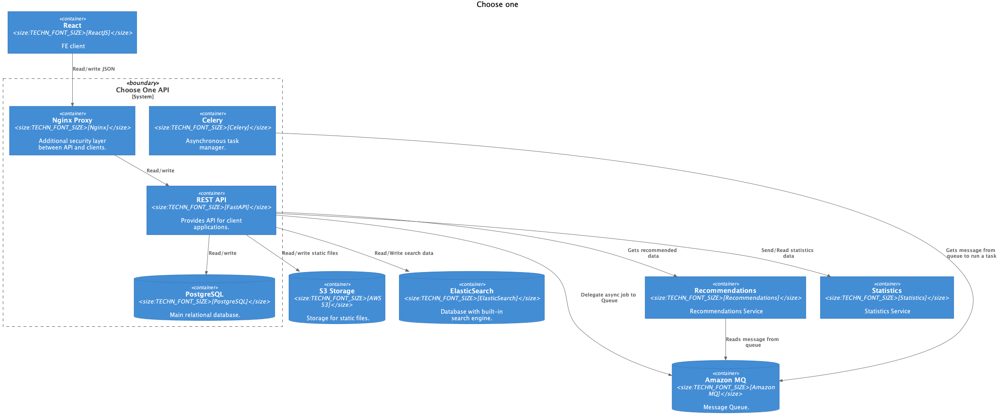

# Choose One BE

### Project Scope

Ultimate solution for choose one.
* Create, update users
* Create, update, delete polls and options
* Allow users to pass polls

### Runtime environment

The infrasturcture of Dream project consists of the following services:

* Choose One Be application
* PostgreSQL Database
* Amazon MQ Broker
* Amazon Elasticsearch
* AWS S3 for media files
* Mailjet for emails



### Commands

The list of custom tasks/commands/scripts that could be run within application

```shell script
docker-compose up
pytest --cov=. tests
```
 
 ### Development environment
 
 Development highly bound to docker, so there is `docker-compose-dev.yml` for development and
run `uvicorn main:app --reload` and `celery ...` by your PyCharm IDE.
**NOTE** you need to pass environment variable in your PyCharm Run configuration.
We use [Poetry](https://python-poetry.org/) for this project.
To install packages simply run `poetry install` right after you configured your environment.
Commonly, you need to work without ElasticSearch run. For that you need to setup
```shell script
TEST_MODE=True
```
environment variable. Due to this SqlAlchemy will not index data to ES.
The same could be set in tests. Then tests for ES will be skipped.

### Test environment
* All external dependencies must be mocked in tests.
* Use `pytest-cov` to measure test coverage. This can be integrated with your PyCharm IDE
* Use `flake8` to check following PEP8 rules
### Commands
```shell script
# Run non-applied migrations
docker exec -it poetry run alembic upgrade head
# When ES enabled, use this command to rebuild indices
docker exec -it poetry shell
# Then you need to import models from base folder
from core.base import *
Poll.reindex()
# To enter interactive Project shell
docker exec -it api poetry shell

